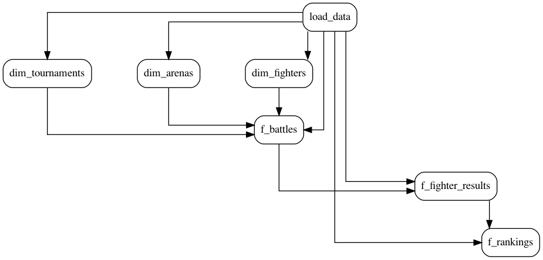

# Tasks

## About

A SAYN project is split into units of execution called tasks. The order of execution of these tasks is given based on the dependencies between them which you specify when writing your tasks. SAYN then takes this information and generates a DAG (Direct Acyclic Graph) automatically.

!!! info
    A Directed Acyclic Graph is a data structure which enables the conveniently modelling of tasks and dependencies:

    * `graph`: a data structure which consists of `nodes` connected by `edges`.
    * `directed`: dependencies have a direction. If there is an `edge` (i.e. a dependency) between two tasks, one will run before the other.
    * `acyclic`: there are no circular dependencies. If you process the whole graph, you will never encounter the same task twice.

Dependencies between tasks are defined based on the tables or views that tasks need to read. In SAYN, this is automated through the concept of `sources` and `outputs`. For more custom use, SAYN also supports the manual definition of relationship between tasks through `parents`.

For example, the SAYN tutorial defines the following DAG:



Through tasks, SAYN provides a lot of automation under the hood, so make sure you explore the various task types SAYN offers!

## Task Types

Please see below the available SAYN task types:

- [`autosql`](autosql.md): simply write a `SELECT` statement and SAYN automates the data processing (i.e. table or view creation, incremental load, etc.) for you.
- [`python`](python.md): enables you to write a Python process. Can be used for a wide range of cases from data extraction to data science models - anything Python lets you do.
- [`copy`](copy.md): enables to automatically copy data from one database to another.
- [`sql`](sql.md): executes any SQL statement. There can be multiple statements within the SQL file.
- [`dummy`](dummy.md): those tasks do not do anything. They can be used as connectors between tasks.

## Defining Tasks

Tasks in SAYN are defined into `groups` which we describe in the `project.yaml` file in your project. Task `groups` define a set of tasks which share the same attributes. For example we can define a group formed of `autosql` tasks called `core` like this:

!!! example "project.yaml"
    ```
    groups:
      core:
        type: autosql
        file_name: "core/*.sql"
        materialisation: table
        destination:
          table: "{{ task.name }}"
    ```

The properties defined in the group tell SAYN how to generate tasks:

  * `type`: this tells SAYN to create tasks of type [autosql](autosql.md)
  * `file_name`: this property tells SAYN what files to use to generate tasks. The files for autosql tasks are stored under the `sql` folder, so this expression is telling us to create a task per file with the extension `sql` found in the `sql/core` folder
  * `materialisation`: describes what database object to create in the database
  * `destination`: defines where to create the database object, in this case we're just using the name, which will simply be the name of the task

!!! attention
    You would always want the `file_name` property used in group definitions to be a [glob expression](https://en.wikipedia.org/wiki/Glob_(programming)) so that it points at a list of files. Any other property defined in groups will be interpreted as described in the page for the task type in this documentation.

    When SAYN interprets this group, for every file found matching the glob expression in `file_name` a task will be generated and the name of that task will match the name of the file without the extension. For example if the `sql/core` folder in our project contains 2 files called `table1.sql` and `table2.sql` then 2 tasks will be created called `table1` and `table2`. To allow those 2 tasks to create different tables in the database we use Jinja expressions. In this case we just call the result table exactly the name of the task using `"{{ task.name }}"`.

Task `groups` are a convenient way to segment and organise your data processes in your SAYN project. Each YAML file in the `tasks` folder represents a task group.

!!! tip
    When growing a SAYN project, it is good practice to start separating your tasks in multiple groups (e.g. extracts, core models, marketing models, finance models, data science, etc.) in order to organise processes.

This definition of `groups` here is available for `autosql`, `sql` and `python` tasks and you can read more by heading to the corresponding pages.

## Task Attributes

!!! example "project.yaml"
    ```
    groups:
      core:
        type: autosql
        file_name: "core/*.sql"
        materialisation: table
        destination:
          table: "{{ task.name }}"
    ```

As you saw in the example above, task attributes can be defined in a dynamic way. This example shows how to use the task name to dynamically define a task. This will effectively tell the task to create the outputs of the `core` tasks into tables based on the `task` name, which is the name of the file without the `.sql` extension for `autosql` tasks.

!!! tip
    You can also reference to `{{ task.group }}` dynamically.

## YAML based definition of tasks

The model described above makes creating a SAYN project very easy, but there are situations where a more advanced model is required. For that we can
define tasks in YAML files under the `tasks` folder at the root level of your SAYN project. Each file in the `tasks` folder represents a [task group](#task_groups) and can be executed independently. By default, SAYN includes any file in the `tasks` folder ending with a `.yaml` extension when creating the DAG.

Within each YAML file, tasks are defined in the `tasks` entry.

!!! example "tasks/base.yaml"
    ```yaml
    tasks:
      task_1:
        # Task properties

      task_2:
        # Task properties

      # ...
    ```

All tasks share a number of common properties available:

| Property | Description | Required |
| -------- | ----------- | ---- |
| type | The task type. | Required one of: `autosql`, `sql`, `python`, `copy`, `dummy` |
| preset | A preset to inherit task properties from. See [the presets section](../presets.md) for more info. | Optional name of preset |
| parents | A list of tasks this one depends on. All tasks in this list is ensured to run before the child task. | Optional list |
| sources | A list of database tables or views this task uses. | Optional list |
| outputs | A list of database tables or views this task produces | Optional list |
| tags | A list of tags used in `sayn run -t tag:tag_name`. This allows for advanced task filtering when we don't want to run all tasks in the project. | Optional list |
| on_fail | Defines the behaviour when the [task fails](#task_failure_behaviour). | Optional one of: `skip` or `no_skip` |

!!! attention
    Different task types have different attributes. Make sure that you check each task type's specific documentation to understand how to define it.

## Task failure behaviour

When a task fails during an execution, all descendent tasks will be skipped as expected. However sometimes it can be useful to
execute descending tasks even if a parent fails, for example when an API can frequently throw errors and we want to continue the execution just with as much data as it was possible to pull from it. In this case we make use of the `on_fail` task property to
specify that we do not want to skip descending tasks.


!!! example "tasks/base.yaml"
    ```yaml
    tasks:
      could_fail_task:
        type: python
        class: could_fail.CouldFailTask
        on_fail: no_skip

      child_task:
        type: sql
        file_name: query_using_could_fail_data.sql
        parents:
          - failing_task
    ```

In the above case, if `could_fail_task` fails, `child_task` will not be skipped.
